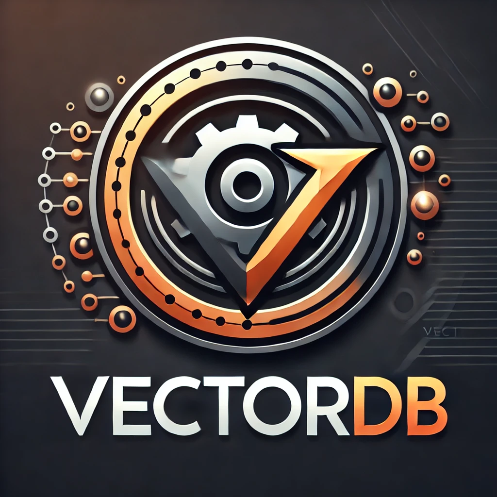

# VectorDB
<div align="center">
    
</div>


A vector database implementation in Rust. A server and client based codebase. Just run the server and call the api endpoints to
1. embed documents
2. Search through.


## Features
- VectorDB Structure: The database is represented by a struct that maps an integer ID to a vector.
- Add : Allows insertion of vectors into the database
- Find Nearest: Computes Euclidean distance between a `query` vector and all vectors in the database returning the close one.
- RocksDB and HNSW Indexing

## Usage
1. Run the server using the following command
```
cargo run
```

2. Use the python client to `add document` and `search`. See [here](examples/client.py)


## TODO
1. Implement more efficient distance calculations.
2. Use advanced datastructures for fast nearest neighbor searches.
3. Metadata storage for filtering